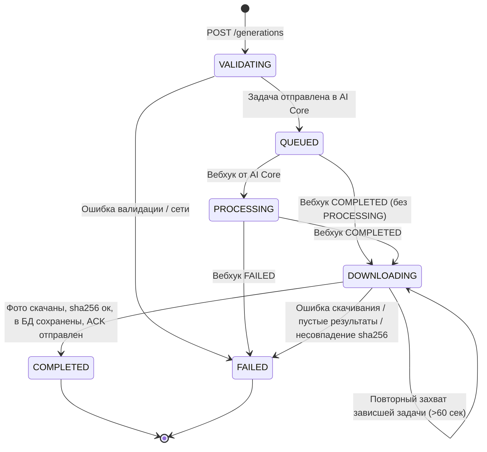

# Архитектура пайплайна генерации и хранилища MinIO

Документ описывает стейт-машину статусов задачи генерации, архитектуру хранения медиафайлов в MinIO (S3) и протокол взаимодействия Backend Core с AI Core.

---

## 1. Стейт-машина статусов (Lifecycle & State Machine)

Каждый процесс генерации образов отслеживается в таблице `albums` через поле `status` (`VARCHAR(20)`).



### 1.1. Описание статусов

| Статус | Значение | Что происходит | Допустимые следующие статусы |
|---|---|---|---|
| `VALIDATING` | Валидация и загрузка исходников | Проверяются размеры (до 10 МБ), magic-bytes, поля анкеты. Исходники заливаются в MinIO. Альбом создается в PostgreSQL. | `QUEUED`, `FAILED` |
| `QUEUED` | В очереди AI Core | Запрос `POST /v1/jobs` успешно отправлен в AI Core. В альбоме сохранен `ai_job_id`. Фронтенду возвращен код `202 Accepted`. | `PROCESSING`, `DOWNLOADING`, `FAILED` |
| `PROCESSING` | Генерация моделями AI | AI Core начал отрисовку образов (пришел промежуточный вебхук `PROCESSING`). | `DOWNLOADING`, `FAILED` |
| `DOWNLOADING` | Захват и скачивание готовых образов | Пришел вебхук `COMPLETED`. Backend атомарно зарезервировал задачу и в фоновом режиме скачивает изображения из AI Core в MinIO. | `COMPLETED`, `FAILED` |
| `COMPLETED` | Генерация и сохранение завершены | Все 10 образов сохранены в MinIO, проверены по sha256, привязаны в таблице `photos`. В AI Core отправлен `ACK`. Альбом готов к выдаче клиенту. | *Терминальный* |
| `FAILED` | Ошибка генерации / скачивания | В поле `error_message` записана причина сбоя. AI Core уведомил об ошибке либо нарушена целостность данных/таймаут. | *Терминальный* |

---

### 1.2. Атомарность, защита от гонок и повторов (Idempotency)

1. **Атомарный захват скачивания (`atomic_claim_for_download`):**
   * Переход в `DOWNLOADING` выполняется одним SQL-запросом `UPDATE albums SET status = 'DOWNLOADING' WHERE id = :id AND (status IN ('QUEUED', 'PROCESSING') OR (status = 'DOWNLOADING' AND updated_at < :stale_time))`.
   * Если два вебхука `COMPLETED` приходят одновременно от AI Core (retry по сети), только один воркер получит строку из БД и запустит скачивание. Второй получит ответ `duplicate_ignored`.

2. **Защита от событий вне порядка (Out-of-Order Events):**
   * Если сетевой пакет вебхука `PROCESSING` задержался и пришел **после** того, как альбом уже перешел в `DOWNLOADING` или `COMPLETED`, метод `atomic_transition` гарантированно отклоняет его (`out_of_order_ignored`). Статус не может откатиться назад.

3. **Восстановление при перезапуске сервера (Stale Recovery):**
   * При перезапуске контейнера или процесса FastAPI фоновые задачи `BackgroundTasks` в оперативной памяти прерываются.
   * При старте приложения в `lifespan` ([`main.py`](../src/backend_core/app/main.py)) вызывается процедура `recover_stuck_downloads()`: все альбомы в статусе `DOWNLOADING` автоматически возобновляют скачивание.
   * Если приходит повторный вебхук от AI Core для альбома, висящего в `DOWNLOADING` дольше 60 секунд, он имеет право повторно захватить слот.

---

## 2. Как устроено хранилище MinIO (S3)

MinIO — это **объектное хранилище (Object Storage)**, совместимое с Amazon S3 API.

### 2.1. Объектная модель против файловой системы

В отличие от обычной файловой системы (где есть физические директории и файлы), в MinIO данные организованы как **Key-Value хранилище**:

$$\text{Ключ (Object Key)} \longrightarrow \text{Значение (Бинарные данные + Метаданные)}$$

* **Бакет (Bucket):** Единственный верхнеуровневый контейнер для проекта — `stylist`. Создается автоматически бэкендом при старте приложения (`StorageService._ensure_bucket()`).
* **Ключ объекта (Object Key):** Строка-идентификатор, например: `albums/0b457e8e-d98c-4f7a-9a90-fa8cefaee1bd/look_00.webp`.
* **Виртуальные «папки»:** Символы слэша `/` в имени ключа не создают физических папок на диске. Это просто префиксы в имени ключа. Веб-интерфейс MinIO и S3-клиенты визуально группируют ключи по префиксам со слэшами для удобства навигации.

### 2.2. Именование ключей в проекте

Все объекты в бакете `stylist` разделены на две категории:

```text
stylist/
├── sources/                                        <-- Исходные фотографии пользователей
│   └── {user_id}/
│       └── {generation_id}/
│           ├── face.jpg (или .png, .webp)
│           └── body.jpg
│
└── albums/                                         <-- Сгенерированные готовые образы (луки)
    └── {album_id}/
        ├── look_00.webp
        ├── look_01.webp
        ├── ...
        └── look_09.webp
```

1. **`sources/{user_id}/{generation_id}/face.{ext}` и `body.{ext}`:**
   * Загружаются пользователем при создании задачи.
   * Ссылки сохраняются в таблице `albums.source_face_key` и `albums.source_body_key`.
   * AI Core забирает их по временным ссылкам.
2. **`albums/{album_id}/look_{order_index:02d}.webp`:**
   * Сгенерированные луки, скачанные из AI Core.
   * Конвертированы/сохранены в оптимизированном формате `image/webp`.
   * Ссылки сохраняются в таблице `photos.object_key`.

---

### 2.3. Безопасность и Presigned URLs

Бакет `stylist` **закрыт от публичного чтения** (`private`). Никто не может получить файл, просто зная его URL.

Для доступа к файлам используются **Presigned URLs (подписанные временные ссылки)**:
* Ссылка содержит в query-параметрах криптографическую подпись HMAC с ограниченным сроком действия (TTL, по умолчанию 3600 секунд):
  ```text
  http://localhost:9000/stylist/albums/.../look_00.webp?X-Amz-Algorithm=AWS4-HMAC-SHA256&X-Amz-Expires=3600&X-Amz-Signature=...
  ```
* **Для AI Core:** Backend генерирует presigned URL исходников, чтобы AI-сервис мог скачать их в течение времени генерации.
* **Для фронтенда:** При запросе `GET /api/v1/albums/{id}` бэкенд на лету генерирует свежие presigned URLs для каждой фотографии в массиве `photos[].image_url`.

---

## 3. Сводная таблица взаимодействия сервисов

| Этап | Инициатор | Запрос / Действие | Ответ / Результат |
|---|---|---|---|
| **Создание** | Фронтенд | `POST /api/v1/generations` | Сохранение исходников в MinIO, запись в PostgreSQL, отправка задачи в AI Core $\rightarrow$ `202 Accepted` |
| **Поллинг** | Фронтенд | `GET /api/v1/generations/{id}/status` | Возвращает `{status: "QUEUED" / "PROCESSING" / "DOWNLOADING"}` |
| **Прогресс** | AI Core | `POST /api/v1/internal/ai-events` (`status: PROCESSING`) | Атомарный перевод альбома в `PROCESSING` |
| **Готовность** | AI Core | `POST /api/v1/internal/ai-events` (`status: COMPLETED`) | Атомарный перевод альбома в `DOWNLOADING`, ответ `200 OK` |
| **Скачивание** | Backend Core (Background) | `GET /v1/jobs/{job_id}` к AI Core | Скачивание 10 луков, сверка SHA-256, запись в MinIO и PostgreSQL (`status: COMPLETED`) |
| **Подтверждение** | Backend Core | `POST /v1/jobs/{job_id}/ack` к AI Core | AI Core освобождает временные файлы у себя в S3 |
| **Отображение** | Фронтенд | `GET /api/v1/albums/{album_id}` | Получение метаданных альбома и 10 presigned URLs для галереи |
