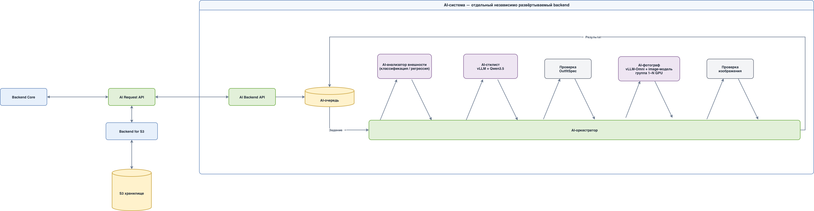

# Архитектура генерации образов AI Stylist

Статус: черновик для обсуждения
Дата: 2 сентября 2026 года

## 1. Цель

Система должна создавать реалистичную фотографию человека в полный рост в новом, подходящем ему комплекте одежды.

На вход поступают:

1. фотография лица человека;
2. фотография человека в полный рост, если она есть;
3. текстовое описание желаемого результата;
4. известные данные о человеке: рост, пол и другие параметры;
5. классы и признаки, полученные на предыдущих этапах обработки.

На выходе система возвращает фотографию человека в полный рост в подобранной одежде.

Повторные запуски для одного человека должны создавать заметно отличающиеся комплекты. Отличие должно обеспечиваться выбором новой одежды, а не только другим случайным `seed` генеративной модели.

## 2. Основная идея

Процесс разделяется на две независимые логические части:

1. **AI-стилист** определяет, во что одеть человека, и формирует структурированное описание комплекта.
2. **AI-фотограф** визуализирует выбранный комплект, сохраняя внешность человека и, при наличии исходной фотографии в полный рост, его телосложение и позу.

### 2.1. Минимальная схема системы



Редактируемый исходник: [ai-system-architecture.drawio](./ai-system-architecture.drawio).

- Основной backend показан только как внешний клиент независимого AI Backend.
- AI Backend владеет очередью, оркестрацией и повторными попытками, но не обращается к базе данных или постоянному файловому хранилищу.
- AI Backend возвращает основному backend статус и результат генерации.
- Model-server'ы доступны AI Backend: стилист масштабируется репликами, фотограф использует одну GPU или неделимую группу GPU.

Мы не передаём генеративной модели расплывчатую команду «одень человека красиво». Сначала система выбирает конкретный комплект, затем отдельно визуализирует его.

## 3. Входные данные

Предварительный внутренний формат задания:

```json
{
  "person_id": "person-123",
  "face_image": {
    "transport": "multipart",
    "part": "face_image",
    "content_type": "image/jpeg"
  },
  "full_body_image": {
    "transport": "multipart",
    "part": "full_body_image",
    "content_type": "image/jpeg"
  },
  "instruction": "Подбери деловой образ для осени",
  "profile": {
    "height_cm": 182,
    "gender": "male",
    "age_group": "30-40"
  },
  "classes": [
    {
      "name": "business",
      "confidence": 0.92
    },
    {
      "name": "minimalism",
      "confidence": 0.81
    }
  ]
}
```

Состав `profile` и перечень классов будут уточняться вместе с предыдущими этапами системы. Для классификаций желательно сохранять не только название класса, но и уверенность модели.

## 4. Общий процесс обработки

```text
Frontend
   │
   ▼
Основной Backend
   │
   ├── авторизация и продуктовая логика
   └── вызов независимого AI Backend
           │
           ▼
AI Backend
   ├── создание AI-задания
   ├── управление очередью
   └── возврат статуса и результата
           │
           ▼
1. Подготовка фотографий
           │
           ▼
2. Подбор нескольких комплектов
           │
           ▼
3. Проверка комплектов на повторение
           │
           ▼
4. Выбор OutfitSpec
           │
           ▼
5. Генерация фотографии
           │
           ▼
6. Автоматическая проверка результата
           │
           ▼
7. Сохранение и выдача результата
```

### 4.1. Подготовка фотографий

Система должна:

- проверить формат, размер и качество изображения;
- убедиться, что на фотографии присутствует ровно один основной человек;
- определить лицо и подготовить референс идентичности;
- для фотографии в полный рост определить позу и границы тела;
- при необходимости построить маску существующей одежды;
- нормализовать ориентацию, цветовое пространство и разрешение.

Результатом этапа являются подготовленные изображения и метаданные, пригодные для генеративной модели.

### 4.2. Подбор одежды

AI-стилист получает:

- текстовое пожелание пользователя;
- профиль человека;
- классы предыдущего этапа;
- историю ранее созданных комплектов;
- в будущем — контекст мероприятия, сезона, погоды и доступного каталога одежды.

Стилист формирует несколько кандидатов в виде `OutfitSpec`, после чего система выбирает подходящий и достаточно новый вариант.

Пример `OutfitSpec`:

```json
{
  "style": "business casual",
  "season": "autumn",
  "fit": "regular",
  "items": [
    {
      "category": "outerwear",
      "type": "single-breasted coat",
      "color": "dark camel",
      "material": "wool"
    },
    {
      "category": "top",
      "type": "shirt",
      "color": "white",
      "material": "cotton"
    },
    {
      "category": "bottom",
      "type": "straight trousers",
      "color": "charcoal"
    },
    {
      "category": "shoes",
      "type": "derby shoes",
      "color": "dark brown"
    }
  ],
  "generation_prompt": "..."
}
```

`generation_prompt` строится из структурированных полей автоматически. Источником истины остаются поля `OutfitSpec`, а не свободный текст.

## 5. Как исключать повторение одежды

Случайный `seed` меняет композицию и детали изображения, но не гарантирует новый комплект. Поэтому история одежды должна храниться отдельно от истории изображений.

Для каждого комплекта создаётся нормализованная подпись:

```text
business-casual:
coat.camel.wool +
shirt.white.cotton +
trousers.charcoal.straight +
derby.brown
```

Алгоритм выбора:

1. получить от AI-стилиста несколько кандидатов;
2. исключить точные совпадения с историей человека;
3. оценить сходство по категориям, цветам, материалам, силуэту и стилю;
4. отклонить кандидатов, слишком похожих на предыдущие комплекты;
5. среди оставшихся выбрать наиболее подходящий;
6. сохранить его подпись после успешной генерации.

На следующих этапах можно дополнительно сравнивать визуальные embedding-векторы готовых изображений, чтобы выявлять повторы, не замеченные по структуре.

## 6. Два режима генерации

### 6.1. Есть фотография в полный рост

Это основной и наиболее предсказуемый режим.

В модель передаются:

- лицо как референс идентичности;
- исходная фотография в полный рост как источник телосложения, пропорций и позы;
- структурированное описание нового комплекта;
- инструкция сохранить лицо, тело и позу, изменив одежду.

```text
Фото лица ───────────────┐
                         ├──► image editing ──► результат
Фото в полный рост ──────┤
                         │
OutfitSpec ──────────────┘
```

Для первой версии продукта фотографию в полный рост рекомендуется сделать обязательной. Это значительно упрощает задачу и повышает стабильность результата.

### 6.2. Нет фотографии в полный рост

В этом режиме система должна синтезировать тело и позу по фотографии лица и параметрам профиля.

```text
Фото лица + профиль + шаблон позы + OutfitSpec
                         │
                         ▼
            синтетическое фото в полный рост
```

Ограничения режима:

- невозможно достоверно восстановить телосложение только по лицу и росту;
- рост без объекта масштаба является лишь текстовой подсказкой;
- поза и пропорции будут частично придуманы моделью;
- результат представляет визуализацию предполагаемого человека, а не точную копию тела.

Этот режим следует добавлять после стабилизации основного сценария.

## 7. Модель AI-стилиста

AI-стилист не генерирует изображение. Его задача — предложить несколько подходящих комплектов и вернуть их в строго заданном формате `OutfitSpec`.

### 7.1. Выбор модели

Основной кандидат для MVP — **Qwen3.5-4B**.

Причины выбора:

- достаточно компактна для запуска на одной GPU;
- принимает текст и изображения;
- подходит для русского пользовательского ввода, что необходимо отдельно подтвердить на нашем тестовом наборе;
- способна следовать сложным инструкциям;
- может работать со structured outputs через vLLM;
- распространяется под Apache 2.0;
- не требует распределённого запуска.

Резервный кандидат — **Qwen3.5-9B**. Переход на него рассматривается, если версия 4B недостаточно хорошо соблюдает ограничения, предлагает однообразные комплекты или плохо справляется со сложным контекстом.

Официальные источники:

- [Qwen3.5-4B](https://huggingface.co/Qwen/Qwen3.5-4B);
- [Qwen3.5-9B](https://huggingface.co/Qwen/Qwen3.5-9B);
- [Structured Outputs в vLLM](https://docs.vllm.ai/en/latest/features/structured_outputs/).

### 7.2. Что получает AI-стилист

Основной вход модели должен состоять из проверенных структурированных данных:

```json
{
  "request": {
    "instruction": "Подбери деловой образ для прохладной осени",
    "occasion": "office",
    "season": "autumn"
  },
  "person": {
    "height_cm": 182,
    "gender": "male",
    "age_group": "30-40"
  },
  "features": {
    "color_palette": ["warm", "muted"],
    "body_features": ["tall", "broad_shoulders"],
    "preferred_styles": ["minimalism", "business"],
    "avoid": ["oversized_upper_body"]
  },
  "allowed_taxonomy": {},
  "previous_outfits": []
}
```

Фотографию можно передавать мультимодальной модели как дополнительный источник контекста, но не следует позволять LLM самостоятельно определять все свойства человека. По возможности визуальные признаки сначала извлекаются специализированным анализатором, проверяются и передаются стилисту явно.

Модель не должна самостоятельно угадывать чувствительные характеристики, оценивать привлекательность человека или менять явно переданные пользователем параметры.

### 7.3. Что возвращает AI-стилист

Модель возвращает несколько кандидатов, соответствующих JSON Schema. Свободный текстовый ответ не используется как источник истины.

Расширенный пример результата:

```json
{
  "outfits": [
    {
      "style": "business_casual",
      "season": "autumn",
      "occasion": "office",
      "fit": "regular",
      "items": [
        {
          "category": "outerwear",
          "type": "single_breasted_coat",
          "color": "dark_camel",
          "material": "wool",
          "fit": "regular"
        },
        {
          "category": "top",
          "type": "shirt",
          "color": "white",
          "material": "cotton",
          "fit": "regular"
        },
        {
          "category": "bottom",
          "type": "straight_trousers",
          "color": "charcoal",
          "material": "wool",
          "fit": "regular"
        },
        {
          "category": "shoes",
          "type": "derby_shoes",
          "color": "dark_brown",
          "material": "leather",
          "fit": null
        }
      ],
      "explanation": "Комплект соответствует деловому стилю и подходит для прохладной осени."
    }
  ]
}
```

В production JSON Schema формируется из backend-моделей, например Pydantic. Для перечислений категорий, типов, цветов, материалов, посадки, сезонов и ситуаций используются enum-значения. Неизвестные значения запрещаются.

### 7.4. Архитектура AI-стилиста

LLM не должна быть единственным механизмом принятия решения. AI-стилист состоит из трёх частей:

```text
Проверяемые правила
        +
       LLM
        +
Валидатор результата
```

**Правила** отвечают за жёсткие ограничения:

- обязательные категории одежды;
- соответствие сезону и ситуации;
- разрешённую таксономию;
- пользовательские запреты;
- совместимость базовых категорий;
- отсутствие точных и слишком близких повторов;
- доступность предметов, если появится товарный каталог.

**LLM** отвечает за творческую часть:

- сочетание предметов;
- подбор цветов и материалов;
- формирование общего стиля;
- создание нескольких кандидатов;
- краткое объяснение выбора.

**Валидатор** проверяет:

- корректность структуры;
- наличие обязательных полей;
- допустимость каждого значения;
- соблюдение ограничений;
- отсутствие внутренних противоречий;
- отличие от предыдущих комплектов.

Если кандидат не прошёл проверку, он удаляется. Если не осталось ни одного кандидата, LLM вызывается повторно с перечнем конкретных ошибок.

### 7.5. Подбор и ранжирование комплектов

Предлагаемый алгоритм:

1. передать модели профиль, пожелания, разрешённую таксономию и историю;
2. получить от трёх до пяти `OutfitSpec`;
3. провалидировать каждый результат программными правилами;
4. рассчитать novelty score относительно истории;
5. рассчитать suitability score по сезону, ситуации, профилю и пожеланиям;
6. исключить слишком похожие или неподходящие варианты;
7. выбрать лучший комплект либо показать пользователю несколько кандидатов;
8. после успешной генерации сохранить выбранный комплект в истории.

Начальные параметры генерации текста подбираются экспериментально. Для разнообразия можно начать с `temperature` около `0.7`, но корректность структуры должна обеспечиваться JSON Schema, а не низкой температурой.

### 7.6. Запуск и требования к ресурсам

Оценки ниже являются начальными инженерными ориентирами и должны быть подтверждены измерениями на выбранном runtime.

| Модель и режим | Ориентир по VRAM | Ориентир по RAM | Применение |
| --- | ---: | ---: | --- |
| Qwen3.5-4B BF16 | 10–14 ГБ | 24–32 ГБ | базовая линия качества |
| Qwen3.5-4B INT4 | 5–7 ГБ | от 16 ГБ | дешёвый production-кандидат |
| Qwen3.5-9B BF16 | 22–24 ГБ | 32–64 ГБ | повышенное качество |
| Qwen3.5-9B INT4 | 9–12 ГБ | 24–32 ГБ | компромисс качества и стоимости |

Рекомендуемая стартовая конфигурация:

```text
Qwen3.5-4B
1 × GPU с 16–24 ГБ VRAM
32 ГБ RAM
vLLM
OpenAI-совместимый внутренний API
JSON Schema structured outputs
```

AI-стилист не нужно распределять между несколькими серверами. При росте нагрузки масштабируются независимые реплики либо увеличивается batch/concurrency в vLLM.

Сервис AI-стилиста разворачивается отдельно от генератора изображений, чтобы текстовая модель не конкурировала с image-edit моделью за GPU-память.

### 7.7. Нужно ли дообучение

Для MVP дообучение не требуется. Сначала используются:

- хороший system prompt;
- строгая JSON Schema;
- ограниченная таксономия;
- программные правила;
- примеры корректных комплектов;
- при необходимости база знаний с правилами стиля.

LoRA-дообучение рассматривается только после накопления собственного набора данных:

- одобренные и отклонённые комплекты;
- пользовательские оценки;
- исправления профессионального стилиста;
- причины отклонения;
- контекст сезона, ситуации и профиля.

Дообучение не заменяет программную валидацию и проверку повторов.

### 7.8. Как проверить модель AI-стилиста

Для сравнения Qwen3.5-4B и Qwen3.5-9B нужен отдельный тестовый набор минимум из 100 сценариев:

- разные сезоны и погодные условия;
- деловой, повседневный и праздничный контекст;
- разные параметры и предпочтения людей;
- ограничения по цветам и материалам;
- запрещённые категории;
- конфликтующие пожелания;
- длинная история предыдущих комплектов;
- запросы на русском языке;
- неполные и неоднозначные запросы.

Для каждого ответа измеряются:

- доля валидных JSON-ответов;
- доля значений, существующих в таксономии;
- соблюдение обязательных и запрещающих правил;
- соответствие сезону и ситуации;
- разнообразие комплектов;
- оценка профессионального стилиста или подготовленных экспертов;
- задержка и стоимость одного запроса;
- стабильность при параллельной нагрузке.

Решение о переходе с 4B на 9B принимается только в том случае, если 9B даёт измеримое улучшение качества, оправдывающее увеличение стоимости.

## 8. Модель генерации

Нам нужна модель класса **multi-reference image editing**, поскольку она должна одновременно учитывать лицо, фотографию тела и текстовое описание одежды.

Кандидаты для эксперимента:

### FLUX.2-klein-4B

- компактная модель;
- поддерживает генерацию и редактирование;
- поддерживает несколько референсных изображений;
- подходит для быстрого прототипа;
- распространяется под Apache 2.0.

### Qwen-Image-Edit-2511

- поддерживает редактирование по нескольким изображениям;
- является кандидатом для более высокого качества и сложных инструкций;
- значительно требовательнее к вычислительным ресурсам;
- поддерживается vLLM-Omni и его image edit API.

Окончательный выбор нельзя делать только по публичным примерам. Обе модели необходимо проверить на одном внутреннем наборе фотографий и заданий.

Критерии сравнения:

- сходство лица;
- сохранение телосложения;
- соответствие `OutfitSpec`;
- качество рук и ног;
- реалистичность одежды и материалов;
- полное попадание человека в кадр;
- скорость генерации;
- потребление GPU-памяти;
- устойчивость при параллельных запросах.

## 9. Автоматическая проверка результата

После генерации результат нельзя сразу отдавать пользователю. Проверяющий этап должен определить:

- сохранилось ли лицо человека;
- присутствует ли человек в полный рост;
- соответствует ли одежда `OutfitSpec`;
- нет ли грубых анатомических и визуальных дефектов;
- не слишком ли результат похож на предыдущие генерации.

Предварительные проверки:

1. сравнение лица с исходным референсом;
2. детекция тела и контроль видимости головы, корпуса, рук и ног;
3. проверка одежды vision-language моделью;
4. проверка безопасности контента;
5. общий quality score.

Если результат не прошёл проверку, система корректирует prompt или `seed` и выполняет повторную генерацию. Количество попыток должно быть ограничено, например тремя.

## 10. Компоненты системы

```text
Основной Backend
   │
   ▼
AI Backend API
   └── AI-очередь заданий
          └── AI-оркестратор
                 ├── Image Preprocessor
                 ├── Outfit Planner
                 ├── Novelty Checker
                 ├── Image Generator
                 └── Result Validator
```

Предварительный выбор технологий:

| Компонент | Назначение | Возможная технология |
| --- | --- | --- |
| AI Backend API | Независимое управление AI-заданиями и оркестрацией | FastAPI |
| AI-очередь | Асинхронная генерация и повторные попытки | Redis-based queue |
| Outfit Planner | Формирование `OutfitSpec` | Qwen3.5-4B, vLLM и проверяемые правила |
| Image Generator | Переодевание человека | FLUX.2-klein или Qwen-Image-Edit |
| Model Server | API и инференс моделей | vLLM, vLLM-Omni или Diffusers |
| Validator | Проверка результата | CV-модели и vision-language модель |

Основной backend должен общаться только с внутренним API независимого AI Backend. AI Backend не обращается к основной базе данных: он принимает задание и возвращает статус или результат генерации. Сохранение результата выполняет основной backend. Внутри AI Backend генератор доступен через интерфейс, не зависящий от конкретной модели.

## 11. Распределённый запуск

Генератор изображений рассматривается как отдельный внутренний сервис:

```text
Основной Backend ──HTTP──► AI Backend
                               │
                               └── Image Generator
                                      ├── GPU host A
                                      └── GPU host B
```

Для основного backend не важно, какие модели, очереди и GPU использует AI Backend. Для AI Backend генератор остаётся одним внутренним model-service независимо от того, работает модель на одной GPU или распределена между несколькими хостами.

Предлагаемый подход:

- сначала проверить pipeline на одной GPU или одном сервере;
- использовать vLLM-Omni для поддерживаемой модели и распределённых режимов;
- использовать Diffusers как эталонную и резервную реализацию;
- при нехватке памяти объединять GPU в одну model-parallel группу;
- масштабировать пропускную способность несколькими одинаковыми группами.

Способ распределения и размер GPU-группы будут выбраны после измерения моделей на целевом оборудовании. Для Qwen-Image-Edit в текущей версии vLLM-Omni следует исследовать tensor parallelism или HSDP; pipeline parallelism для этой модели не является подтверждённым вариантом.

## 12. Публичное API

Публичные endpoints предоставляет основной backend. Он преобразует запросы в вызовы внутреннего API AI Backend и не раскрывает клиенту устройство AI-очереди или model-server'ов.

Предварительные endpoints основного backend:

```http
POST /api/v1/generations
GET  /api/v1/generations/{generation_id}
POST /api/v1/generations/{generation_id}/cancel
GET  /api/v1/persons/{person_id}/outfits
```

Создание генерации должно быть асинхронным:

```json
{
  "generation_id": "generation-456",
  "status": "queued"
}
```

Возможные статусы:

```text
queued
planning
generating
validating
retrying
completed
failed
cancelled
```

## 13. Хранение результата

После получения результата от AI Backend основной backend сохраняет:

```json
{
  "person_id": "person-123",
  "generation_id": "generation-456",
  "outfit_spec": {},
  "outfit_signature": "...",
  "seed": 819274,
  "model": "Qwen-Image-Edit-2511",
  "model_revision": "...",
  "result_url": "s3://bucket/generation-456/result.png",
  "quality_score": 0.91
}
```

Версия модели, параметры генерации и `seed` нужны для воспроизводимости и расследования ошибок.

## 14. Безопасность и персональные данные

Фотографии лица являются чувствительными персональными данными. Необходимо предусмотреть:

- явное согласие пользователя на обработку фотографий;
- проверку права пользователя использовать загруженное изображение;
- шифрование файлов и соединений;
- ограниченный срок хранения исходных фотографий;
- возможность удалить профиль и все связанные данные;
- запрет публичного доступа к исходным файлам;
- журналирование доступа без попадания фотографий и персональных данных в логи;
- защиту от генерации запрещённого и вредоносного контента.

## 15. Границы первой версии

Для MVP принимаются следующие ограничения:

1. фотография лица обязательна;
2. фотография в полный рост обязательна;
3. на фотографии должен быть один человек;
4. сохраняется исходная поза;
5. одежда создаётся по описанию, без привязки к конкретному товару из каталога;
6. за один запрос создаётся несколько разных `OutfitSpec`, но визуализируется выбранный комплект;
7. история комплектов используется для исключения повторений;
8. генерация выполняется асинхронно;
9. при неудачной проверке разрешено до трёх попыток;
10. сначала сравниваются FLUX.2-klein-4B и Qwen-Image-Edit-2511;
11. AI-стилист запускается на Qwen3.5-4B;
12. ответы AI-стилиста ограничиваются JSON Schema и проверяются программными правилами.

## 16. Последовательность разработки

### Этап 1. Проверка идеи

- подготовить небольшой закрытый тестовый набор;
- реализовать формирование `OutfitSpec`;
- подготовить таксономию одежды и правила валидации;
- сравнить Qwen3.5-4B и Qwen3.5-9B на тестах AI-стилиста;
- проверить генерацию с лицом и фотографией в полный рост;
- сравнить модели по единым критериям;
- определить минимальные требования к GPU.

### Этап 2. MVP

- реализовать асинхронное API;
- добавить хранилище изображений;
- сохранять историю комплектов;
- исключать повторы;
- добавить базовую автоматическую проверку результата;
- реализовать удаление пользовательских данных.

### Этап 3. Повышение качества

- улучшить сохранение лица и телосложения;
- добавить автоматический выбор лучшего результата;
- учитывать пользовательские оценки;
- улучшить подбор одежды;
- добавить разные позы и фоны.

### Этап 4. Масштабирование

- вынести генератор в отдельный model-serving сервис;
- добавить распределённый запуск на нескольких GPU-хостах;
- добавить несколько inference-групп для параллельных запросов;
- настроить мониторинг времени, ошибок и потребления GPU.

### Этап 5. Расширение сценариев

- разрешить генерацию без фотографии в полный рост;
- поддержать фотографии конкретных предметов одежды;
- при необходимости добавить специализированный virtual try-on pipeline;
- интегрировать каталог реально доступной одежды.

## 17. Открытые вопросы

До реализации необходимо уточнить:

1. какие именно классы приходят с предыдущего этапа;
2. какие параметры человека обязательны и как они используются;
3. допустимо ли менять позу и фон;
4. нужно ли генерировать один или несколько результатов на комплект;
5. сколько времени пользователь готов ждать результат;
6. какое оборудование доступно для тестирования и production;
7. должна ли одежда быть полностью вымышленной или позже появится каталог товаров;
8. какие метрики определяют «подходящую» одежду;
9. какой минимальный уровень сходства лица считается приемлемым;
10. как долго разрешено хранить исходные фотографии;
11. кто отвечает за подготовку и утверждение таксономии одежды;
12. какие правила подбора должны быть жёсткими, а какие рекомендательными;
13. кто и по какой методике оценивает качество предложений AI-стилиста.

## 18. Критерии успеха MVP

MVP считается успешным, если:

- система стабильно создаёт фотографию в полный рост;
- лицо визуально соответствует входному изображению;
- исходное телосложение и поза в основном сохраняются;
- одежда соответствует выбранному `OutfitSpec`;
- последовательные генерации дают разные комплекты;
- AI-стилист возвращает валидный `OutfitSpec` и соблюдает таксономию;
- предложения AI-стилиста проходят согласованную экспертную оценку;
- неуспешные результаты обнаруживаются до выдачи пользователю;
- каждое задание воспроизводимо по сохранённым параметрам;
- персональные данные можно полностью удалить.
