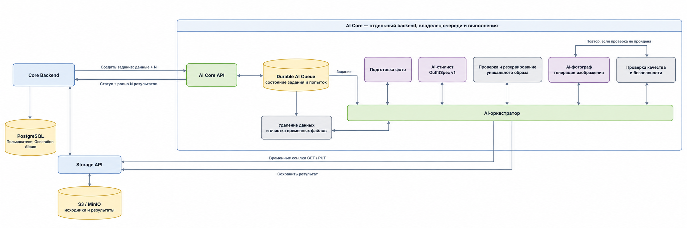

# Архитектура генерации образов AI Stylist

## 1. Назначение документа

Этот документ описывает общую архитектуру AI Core: границы системы, владельцев
данных и основной путь выполнения задания. Форматы запросов и ответов вынесены в
[отдельный договор](ai-core-contract.md), а внутреннее хранение состояния — в
[описание очереди](job-state-and-queue.md).

## 2. Цель

AI Core должен создать запрошенное количество реалистичных фотографий человека
в полный рост в разных подходящих комплектах одежды. Лицо и телосложение должны
сохраняться, а комплекты внутри одного задания не должны повторяться.

Основной сервер передаёт:

1. временную ссылку на фотографию лица;
2. временную ссылку на фотографию в полный рост;
3. профиль и пожелания пользователя;
4. требуемое количество итоговых изображений.

Задание считается успешно завершённым только тогда, когда AI Core получил ровно
запрошенное количество изображений, прошедших проверку.

## 3. Границы ответственности

### 3.1. Основной сервер

Основной сервер отвечает за:

- пользователя и его права доступа;
- приём анкеты и исходных фотографий;
- собственный идентификатор пользовательской генерации;
- создание альбома;
- постоянное хранение исходников и готовых результатов;
- удаление альбомов и постоянных файлов;
- показ пользователю состояния, полученного от AI Core.

### 3.2. AI Core

AI Core является владельцем:

- своей постоянной очереди заданий;
- внутреннего идентификатора задания;
- состояния задания и каждой создаваемой фотографии;
- последовательности этапов обработки;
- повторных попыток;
- резервирования неповторяющихся комплектов;
- временных копий и промежуточных изображений;
- проверки качества и безопасности результата;
- уведомлений основного сервера о смене состояния.

AI Core не создаёт альбомы и не удаляет постоянные пользовательские файлы. После
отмены задания он прекращает работу и очищает только собственные временные данные.

### 3.3. Модуль хранения

Модуль хранения выдаёт AI Core короткоживущие ссылки на чтение или запись строго
определённых объектов. AI Core не получает постоянные учётные данные хранилища и
не может просматривать или удалять произвольные пользовательские файлы.

## 4. Схема системы



AI Core разворачивается независимо от основного сервера. На первой версии его
внутренние части могут работать в одном приложении или на одном сервере. Отдельные
службы моделей и распределённый запуск добавляются только после измерений.

## 5. Общий процесс

```text
Основной сервер
   │
   ├── сохраняет исходные фотографии
   ├── создаёт свой идентификатор генерации
   └── отправляет AI Core данные, временные ссылки и количество изображений
           │
           ▼
AI Core
   ├── защищается от повторного создания того же задания
   ├── копирует исходники во временную область
   ├── сохраняет задание в собственной базе
   └── ставит задание в собственную очередь
           │
           ▼
1. Подготовка фотографий
           │
           ▼
2. Подбор и проверка OutfitSpec
           │
           ▼
3. Резервирование уникального комплекта
           │
           ▼
4. Генерация изображения
           │
           ▼
5. Проверка качества и безопасности
           │
           ├── не принято: повторить в пределах установленного лимита
           └── принято: сохранить результат и перейти к следующему месту
           │
           ▼
6. Завершить, когда принято требуемое количество изображений
           │
           ▼
7. Уведомить основной сервер и очистить временные данные
```

## 6. Компоненты AI Core

| Компонент | Ответственность |
| --- | --- |
| Внешний программный интерфейс | Создание, чтение и отмена заданий |
| База AI Core | Постоянное состояние очереди, заданий, попыток и уведомлений |
| Исполнители | Получение задания в аренду и выполнение обработки |
| Управляющий процесс | Порядок этапов и внутренние повторные попытки |
| AI-стилист | Формирование и проверка описания комплекта `OutfitSpec` |
| Проверка новизны | Атомарное резервирование комплекта внутри задания |
| AI-фотограф | Создание изображения по исходникам и `OutfitSpec` |
| Проверка результата | Контроль сходства, полного роста, одежды, качества и безопасности |
| Очистка | Удаление временных копий и незавершённых результатов AI Core |

## 7. Важные правила

- Одно задание имеет только одного активного исполнителя.
- После сбоя задание продолжает другой исполнитель на основании сохранённого
  состояния.
- Комплект резервируется до генерации изображения, поэтому два исполнителя не
  могут одновременно выбрать один комплект.
- Не прошедшее проверку изображение не входит в требуемое количество.
- Пользователь не получает промежуточные и непроверенные изображения.
- Повтор одного запроса не создаёт второе задание.
- Основной сервер получает уведомления, но при необходимости может запросить
  текущее состояние напрямую у AI Core.
- Постоянные результаты принадлежат основному серверу; временные данные принадлежат
  AI Core.

## 8. Отдельные решения

- Форматы взаимодействия: [ai-core-contract.md](ai-core-contract.md).
- Состояния, таблицы и восстановление: [job-state-and-queue.md](job-state-and-queue.md).
- Ограничения и сроки: [configuration.md](configuration.md).
- Структура комплекта и модели: [model-selection-and-implementation.md](model-selection-and-implementation.md).
- Правила сравнения моделей: [model-benchmark.md](model-benchmark.md).
