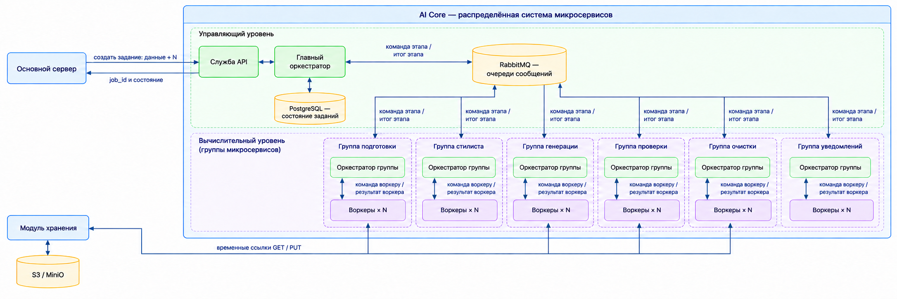

# Архитектура генерации образов AI Stylist

## 1. Назначение документа

Этот документ описывает общую архитектуру AI Core: границы системы, владельцев
данных и основной путь выполнения задания.

## 2. Цель

AI Core должен создать запрошенное количество реалистичных фотографий человека
в полный рост в разных подходящих комплектах одежды. Лицо и телосложение должны
сохраняться, а комплекты внутри одного задания не должны повторяться.

Основной сервер передаёт временные ссылки на фотографии, профиль и пожелания
пользователя, а также требуемое количество результатов. Задание считается
успешным только после получения ровно этого количества проверенных изображений.

## 3. Границы ответственности

### 3.1. Основной сервер

Основной сервер отвечает за пользователя, права доступа, анкету, постоянное
хранение исходников и результатов, альбом и показ состояния пользователю. Он
создаёт свой ключ запроса, но AI Core не обязан знать внутренний идентификатор
основного сервера.

### 3.2. AI Core

AI Core отвечает за свою очередь, внутренний `job_id`, ход обработки, повторные
попытки, неповторяющиеся комплекты, проверку результата, временные данные и
уведомления основного сервера.

AI Core состоит из нескольких независимо разворачиваемых микросервисов. Каждый
воркер можно запускать в нескольких копиях и на разных хостах.

### 3.3. Модуль хранения

Модуль хранения выдаёт короткоживущие ссылки на чтение или запись только нужных
объектов. Службы AI Core не получают постоянный доступ ко всему хранилищу.
Удаление альбомов и постоянных файлов остаётся обязанностью основного сервера.

## 4. Схема системы



Внутри AI Core три уровня:

- служба API принимает внешние запросы;
- главный оркестратор управляет всем конвейером и общим состоянием задания;
- шесть функциональных групп выполняют этапы, причём у каждой группы есть свой
  оркестратор, собственная база состояния и несколько воркеров.

## 5. Состав микросервисов

| Микросервис | Что делает | Как масштабируется |
| --- | --- | --- |
| Служба API | Принимает создание, чтение и отмену задания | Несколько одинаковых копий |
| Главный оркестратор | Хранит ход задания и запускает функциональные группы | Несколько копий с согласованием через общую базу |
| Оркестратор подготовки | Управляет попытками подготовки исходников | Отдельно от воркеров подготовки |
| Воркеры подготовки | Проверяют и копируют исходники | Независимые копии на разных узлах |
| Оркестратор стилиста | Управляет попытками подбора комплектов | Отдельно от воркеров стилиста |
| Воркеры-стилисты | Создают и проверяют `OutfitSpec` | Независимые копии на подходящих узлах |
| Оркестратор генерации | Управляет попытками создания кандидата | Отдельно от GPU-воркеров |
| Воркеры генерации | Создают изображения | Независимые копии на GPU-узлах |
| Оркестратор проверки | Управляет обязательными проверками | Отдельно от воркеров проверки |
| Воркеры проверки | Оценивают качество и безопасность | Независимые копии на подходящих узлах |
| Оркестратор очистки | Делит очистку на части и повторяет ошибки | Отдельно от воркеров очистки |
| Воркеры очистки | Удаляют временные объекты AI Core | Независимые копии на разных узлах |
| Оркестратор уведомлений | Управляет повторной доставкой событий | Отдельно от воркеров уведомлений |
| Воркеры уведомлений | Отправляют события основному серверу | Независимые копии на разных узлах |

Подробности каждой службы находятся в каталоге
[services](services/README.md).

## 6. Как проходит задание

```text
Основной сервер
    │ создаёт задание
    ▼
Служба API
    │ передаёт запрос главному оркестратору
    ▼
Главный оркестратор ── сохраняет состояние задания ──► Общая PostgreSQL
    │
    ├──► RabbitMQ ──► Оркестратор подготовки ──► RabbitMQ ──► Воркеры подготовки
    │◄── итог группы ◄──────────────────────────────────────────────────────────┘
    ├──► RabbitMQ ──► Оркестратор стилиста ─────► RabbitMQ ──► Воркеры-стилисты
    │◄── итог группы ◄──────────────────────────────────────────────────────────┘
    ├── резервирует неповторяющийся комплект
    ├──► RabbitMQ ──► Оркестратор генерации ────► RabbitMQ ──► Воркеры генерации
    │◄── итог группы ◄──────────────────────────────────────────────────────────┘
    ├──► RabbitMQ ──► Оркестратор проверки ─────► RabbitMQ ──► Воркеры проверки
    │◄── итог группы ◄──────────────────────────────────────────────────────────┘
    ├── повторяет генерацию, если проверка не пройдена
    └── завершает задание, когда принято нужное количество изображений
            │
            ├──► Оркестратор уведомлений ──► Воркеры уведомлений ──► Основной сервер
            └──► Оркестратор очистки ──────► Воркеры очистки ──────► Временные данные
```

Каждый оркестратор сначала сохраняет свой переход в своей PostgreSQL. Команда
попадает в RabbitMQ через таблицу исходящих сообщений. Поэтому остановка любого
оркестратора между записью состояния и отправкой не приводит к потере работы.

## 7. Правила взаимодействия

- Главный оркестратор не вызывает воркеры напрямую.
- Каждый групповой оркестратор общается только с главным оркестратором и воркерами
  своей группы.
- Воркеры не вызывают друг друга и не читают базы оркестраторов.
- RabbitMQ доставляет команды и результаты, но не является источником полного
  состояния задания.
- Только главный оркестратор решает, какой этап запускать дальше и завершено ли
  всё задание.
- Групповой оркестратор отвечает за попытки только своего этапа.
- Повторная доставка одного сообщения безопасна: получатель проверяет
  `message_id`, `job_id`, номер попытки и `lease_token`.
- Устаревший результат после отмены или повторного запуска не принимается.
- Непроверенное изображение не считается готовым результатом.
- Постоянные результаты принадлежат основному серверу; AI Core удаляет только
  собственные временные данные.

## 8. Развёртывание на разных хостах

Все службы собираются и разворачиваются отдельно. У каждой группы независимо
задаются число копий оркестратора и воркеров, ограничения процессора, памяти и
графического процессора.

Например, стилист может работать на двух недорогих узлах, генератор — на четырёх
узлах с графическими процессорами, а проверка — на отдельной группе узлов. Чтобы
добавить мощность одному этапу, не требуется перезапускать остальные службы.

Общие для всех хостов зависимости: доступ к RabbitMQ и сбору технических
показателей. Главный оркестратор имеет свою PostgreSQL, каждая группа — отдельную
PostgreSQL или отдельную изолированную базу. Служба API обращается только к
внутреннему интерфейсу главного оркестратора. Доступ к временным объектам получают
только нужные воркеры по ограниченным ссылкам.

## 9. Цена такого разделения

Два уровня оркестрации дают независимое управление каждой группой и скрывают от
главного конвейера детали моделей. Цена решения — больше служб, баз, очередей и
сетевых отказов. Поэтому границы владения состоянием, версии сообщений, защита от
повторов и наблюдение за каждой группой обязательны с первой серверной версии.

## 10. Связанные документы

- [Внешний договор](ai-core-contract.md)
- [Договор обмена сообщениями](message-contracts.md)
- [Состояния и очереди](job-state-and-queue.md)
- [Настройки](configuration.md)
- [Выбор моделей](model-selection-and-implementation.md)
- [Проверка моделей](model-benchmark.md)
- [Последовательность разработки](development-roadmap.md)
