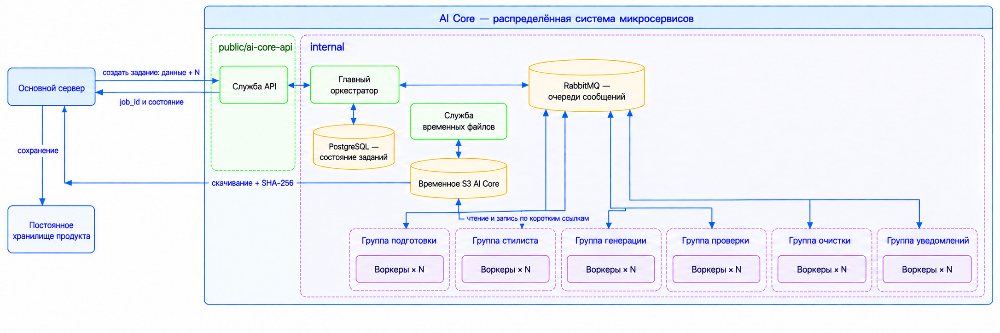

# Внутренняя архитектура AI Core

Этот документ определяет только границы и связи. Ответственность конкретной
службы описывается в её папке, форматы сообщений — в
[messaging.md](messaging.md), состояние — в [state.md](state.md).

## Цель

AI Core создаёт ровно запрошенное количество проверенных изображений, сохраняет
лицо и телосложение человека и не повторяет комплекты внутри задания.

## Уровни системы



1. Внешний интерфейс AI Core принимает запросы основного сервера.
2. Главный оркестратор владеет ходом задания, единственной базой состояния и
   выбирает следующий вид воркера.
3. Общий RabbitMQ доставляет команду свободной копии нужного воркера и возвращает
   результат главному оркестратору.
4. Воркер выполняет одну команду и не выбирает следующий этап.
5. Служба временных файлов выдаёт ограниченные ссылки на временное хранилище
   AI Core. Байты изображений не проходят через интерфейс, оркестратор или очередь.
6. Основной сервер скачивает готовые результаты напрямую, сохраняет их в своём
   постоянном хранилище и подтверждает получение.

## Блоки

- [Управление конвейером](blocks/orchestration/README.md)
- [Доступ к временным файлам](blocks/artifacts/README.md)
- [Подготовка фотографий](blocks/preparation/README.md)
- [Подбор комплекта](blocks/styling/README.md)
- [Генерация изображения](blocks/generation/README.md)
- [Проверка результата](blocks/verification/README.md)
- [Очистка временных данных](blocks/cleanup/README.md)
- [Доставка уведомлений](blocks/notification/README.md)

## Путь задания

```text
Основной сервер
  → внешний интерфейс AI Core
  → главный оркестратор
  → блок подготовки
  → блок стилиста
  → резервирование комплекта главным оркестратором
  → блок генерации
  → блок проверки
  → повтор генерации или принятие результата
  → завершение после получения N результатов
  → скачивание результатов основным сервером
  → подтверждение получения
  → блок уведомлений и блок очистки
```

## Архитектурные правила

- Главный оркестратор напрямую публикует команды каждому виду воркеров и читает
  их результаты.
- Воркеры не вызывают друг друга.
- Только главный оркестратор выбирает следующий этап и создаёт новую продуктовую
  попытку.
- Один вид состояния имеет одного владельца.
- Один RabbitMQ на окружение переносит сообщения, распределяет команды между
  копиями воркера и создаёт обратное давление, но не хранит состояние процесса.
- Все службы могут разворачиваться и масштабироваться независимо.
- Временное S3-совместимое хранилище принадлежит AI Core. Единственные сведения
  о его устройстве и жизненном цикле находятся в [artifacts.md](artifacts.md).
- Постоянное хранилище продукта находится за границей AI Core. Здесь определена
  только передача готового результата и подтверждение получения.
- Интерфейс, оркестратор и RabbitMQ не передают байты изображений. Воркеры и
  основной сервер обращаются к временным файлам напрямую по коротким ссылкам.
- Добавление блока требует новой пары очередей и договора воркера, но не изменения
  публичного API, если пользовательское поведение не меняется.

## Принятый компромисс

Один оркестратор уменьшает число служб, баз и сетевых отказов, но делает его
центральным владельцем всего конвейера. Текущая архитектура не содержит других
оркестраторов. Если этап когда-нибудь станет самостоятельным многошаговым
конвейером, его выделение потребует нового архитектурного решения и замены этого
документа; простое масштабирование воркеров для этого не является причиной.
