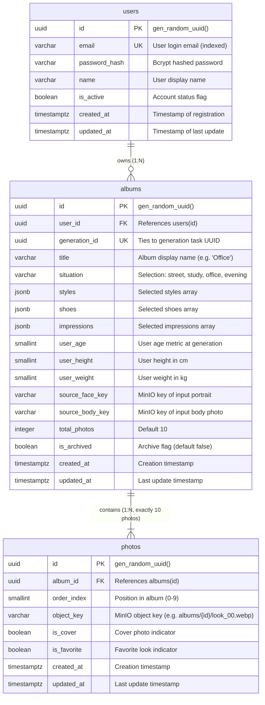

# Database Structure (PostgreSQL 16)

This document describes the core relational database schema for the **AI Stylist** backend service, covering `users`, `albums`, and `photos`.

---

## 1. Entity-Relationship Diagram (ERD)



---

## 2. Table Specifications

### 2.1. `users`
Stores registered user accounts and authentication credentials.

| Column | Type | Constraints | Description |
|---|---|---|---|
| `id` | `UUID` | `PRIMARY KEY`, default `gen_random_uuid()` | Unique user identifier |
| `email` | `VARCHAR(255)` | `NOT NULL`, `UNIQUE`, `INDEX` | User email address used for login |
| `password_hash` | `VARCHAR(255)` | `NOT NULL` | Bcrypt password hash |
| `name` | `VARCHAR(100)` | `NOT NULL` | User name |
| `created_at` | `TIMESTAMPTZ` | `NOT NULL`, default `CURRENT_TIMESTAMP` | Account creation timestamp |
| `updated_at` | `TIMESTAMPTZ` | `NOT NULL`, default `CURRENT_TIMESTAMP` | Account last update timestamp |

**Indexes & Constraints:**
- `pk_users`: `PRIMARY KEY (id)`
- `uq_users_email`: `UNIQUE (email)`
- `idx_users_email`: B-tree index on `email`

---

### 2.2. `albums`
Stores generated collections of looks produced for a user. Each album is created after the AI module finishes generating 10 looks.

| Column | Type | Constraints | Description |
|---|---|---|---|
| `id` | `UUID` | `PRIMARY KEY`, default `gen_random_uuid()` | Unique album identifier |
| `user_id` | `UUID` | `NOT NULL`, `REFERENCES users(id) ON DELETE CASCADE` | Owner user ID |
| `generation_id` | `UUID` | `NOT NULL`, `UNIQUE`, `INDEX` | Associated generation task identifier |
| `title` | `VARCHAR(100)` | `NOT NULL` | Album title (default based on situation, e.g. "Office") |
| `situation` | `VARCHAR(50)` | `NOT NULL` | Target situation (`street`, `study`, `office`, `evening`) |
| `styles` | `JSONB` | `NOT NULL` | Selected styles (e.g. `["minimalism", "classic"]`) |
| `shoes` | `JSONB` | `NOT NULL` | Selected shoes (e.g. `["loafers"]`) |
| `impressions` | `JSONB` | `NOT NULL` | Selected impressions (e.g. `["confident", "elegant"]`) |
| `user_age` | `SMALLINT` | `NULL` | Age at the time of generation |
| `user_height` | `SMALLINT` | `NULL` | Height (cm) at the time of generation |
| `user_weight` | `SMALLINT` | `NULL` | Weight (kg) at the time of generation |
| `total_photos` | `INTEGER` | `NOT NULL`, default `10` | Total number of photos in the album |
| `is_archived` | `BOOLEAN` | `NOT NULL`, default `FALSE` | Archive status flag |
| `created_at` | `TIMESTAMPTZ` | `NOT NULL`, default `CURRENT_TIMESTAMP` | Generation completion / album creation timestamp |
| `updated_at` | `TIMESTAMPTZ` | `NOT NULL`, default `CURRENT_TIMESTAMP` | Last update timestamp |

**Indexes & Constraints:**
- `pk_albums`: `PRIMARY KEY (id)`
- `fk_albums_user_id`: `FOREIGN KEY (user_id) REFERENCES users(id) ON DELETE CASCADE`
- `uq_albums_generation_id`: `UNIQUE (generation_id)`
- `idx_albums_user_id`: B-tree index on `user_id` (optimizes `GET /api/v1/albums`)
- `idx_albums_created_at`: B-tree index on `(user_id, created_at DESC)` for sorted album lists
- `idx_albums_is_archived`: B-tree index on `(user_id, is_archived)`

---

### 2.3. `photos`
Stores individual looks within an album.

| Column | Type | Constraints | Description |
|---|---|---|---|
| `id` | `UUID` | `PRIMARY KEY`, default `gen_random_uuid()` | Unique photo identifier |
| `album_id` | `UUID` | `NOT NULL`, `REFERENCES albums(id) ON DELETE CASCADE` | Album identifier |
| `order_index` | `SMALLINT` | `NOT NULL` | Display order index (0 to 9) |
| `object_key` | `VARCHAR(512)` | `NOT NULL` | Object path in MinIO (e.g. `albums/3fa85f64/look_00.webp`) |
| `created_at` | `TIMESTAMPTZ` | `NOT NULL`, default `CURRENT_TIMESTAMP` | Creation timestamp |


**Indexes & Constraints:**
- `pk_photos`: `PRIMARY KEY (id)`
- `fk_photos_album_id`: `FOREIGN KEY (album_id) REFERENCES albums(id) ON DELETE CASCADE`
- `uq_photos_album_order`: `UNIQUE (album_id, order_index)` ensures unique ordering slots within an album
- `idx_photos_album_id`: B-tree index on `album_id`
- `idx_photos_favorite`: Partial index on `(album_id, is_favorite)` where `is_favorite = TRUE`

---

## 3. Storage Strategy (MinIO & Presigned URLs)

1. **Object Key vs URL:**
   - The database **only** persists `object_key` strings (e.g., `albums/3fa85f64/look_00.webp`).
   - URLs are never stored statically in PostgreSQL because presigned URLs are temporary and cryptographically signed.
2. **Dynamic URL Resolution:**
   - When serving `GET /api/v1/albums/{album_id}`, the service iterates over the album's photos and invokes `minio_client.presigned_get_object(...)` with a configurable TTL (e.g. 3600 seconds) to populate the `url` field in the response DTO.

---

## 4. PostgreSQL 16 DDL Script

```sql
-- Enable pgcrypto for gen_random_uuid() if required (built-in in PG 16)
CREATE EXTENSION IF NOT EXISTS "pgcrypto";

-- =============================================================================
-- Table: users
-- =============================================================================
CREATE TABLE users (
    id UUID PRIMARY KEY DEFAULT gen_random_uuid(),
    email VARCHAR(255) NOT NULL,
    password_hash VARCHAR(255) NOT NULL,
    name VARCHAR(100) NOT NULL,
    is_active BOOLEAN NOT NULL DEFAULT TRUE,
    created_at TIMESTAMPTZ NOT NULL DEFAULT CURRENT_TIMESTAMP,
    updated_at TIMESTAMPTZ NOT NULL DEFAULT CURRENT_TIMESTAMP,
    CONSTRAINT uq_users_email UNIQUE (email)
);

CREATE INDEX idx_users_email ON users(email);

-- =============================================================================
-- Table: albums
-- =============================================================================
CREATE TABLE albums (
    id UUID PRIMARY KEY DEFAULT gen_random_uuid(),
    user_id UUID NOT NULL,
    generation_id UUID NOT NULL,
    title VARCHAR(100) NOT NULL,
    situation VARCHAR(50) NOT NULL,
    styles JSONB NOT NULL DEFAULT '[]'::jsonb,
    shoes JSONB NOT NULL DEFAULT '[]'::jsonb,
    impressions JSONB NOT NULL DEFAULT '[]'::jsonb,
    user_age SMALLINT NULL,
    user_height SMALLINT NULL,
    user_weight SMALLINT NULL,
    source_face_key VARCHAR(512) NULL,
    source_body_key VARCHAR(512) NULL,
    total_photos INTEGER NOT NULL DEFAULT 10,
    is_archived BOOLEAN NOT NULL DEFAULT FALSE,
    created_at TIMESTAMPTZ NOT NULL DEFAULT CURRENT_TIMESTAMP,
    updated_at TIMESTAMPTZ NOT NULL DEFAULT CURRENT_TIMESTAMP,
    CONSTRAINT fk_albums_user_id FOREIGN KEY (user_id) REFERENCES users(id) ON DELETE CASCADE,
    CONSTRAINT uq_albums_generation_id UNIQUE (generation_id)
);

CREATE INDEX idx_albums_user_id ON albums(user_id);
CREATE INDEX idx_albums_user_created ON albums(user_id, created_at DESC);
CREATE INDEX idx_albums_generation_id ON albums(generation_id);

-- =============================================================================
-- Table: photos
-- =============================================================================
CREATE TABLE photos (
    id UUID PRIMARY KEY DEFAULT gen_random_uuid(),
    album_id UUID NOT NULL,
    order_index SMALLINT NOT NULL,
    object_key VARCHAR(512) NOT NULL,
    is_cover BOOLEAN NOT NULL DEFAULT FALSE,
    is_favorite BOOLEAN NOT NULL DEFAULT FALSE,
    created_at TIMESTAMPTZ NOT NULL DEFAULT CURRENT_TIMESTAMP,
    updated_at TIMESTAMPTZ NOT NULL DEFAULT CURRENT_TIMESTAMP,
    CONSTRAINT fk_photos_album_id FOREIGN KEY (album_id) REFERENCES albums(id) ON DELETE CASCADE,
    CONSTRAINT uq_photos_album_order UNIQUE (album_id, order_index),
    CONSTRAINT chk_photos_order_index CHECK (order_index >= 0 AND order_index < 10)
);

CREATE INDEX idx_photos_album_id ON photos(album_id);
CREATE INDEX idx_photos_album_order ON photos(album_id, order_index);
```

---

## 5. SQLAlchemy 2.0 ORM Models Reference

```python
import uuid
from datetime import datetime
from typing import List, Optional
from sqlalchemy import (
    Boolean, CheckConstraint, ForeignKey, Index, Integer,
    SmallInteger, String, UniqueConstraint, func
)
from sqlalchemy.dialects.postgresql import JSONB, UUID
from sqlalchemy.orm import DeclarativeBase, Mapped, mapped_column, relationship


class Base(DeclarativeBase):
    pass


class User(Base):
    __tablename__ = "users"

    id: Mapped[uuid.UUID] = mapped_column(
        UUID(as_uuid=True), primary_key=True, default=uuid.uuid4
    )
    email: Mapped[str] = mapped_column(String(255), unique=True, index=True, nullable=False)
    password_hash: Mapped[str] = mapped_column(String(255), nullable=False)
    name: Mapped[str] = mapped_column(String(100), nullable=False)
    is_active: Mapped[bool] = mapped_column(Boolean, default=True, nullable=False)
    created_at: Mapped[datetime] = mapped_column(server_default=func.now(), nullable=False)
    updated_at: Mapped[datetime] = mapped_column(
        server_default=func.now(), onupdate=func.now(), nullable=False
    )

    albums: Mapped[List["Album"]] = relationship(
        "Album", back_populates="user", cascade="all, delete-orphan"
    )


class Album(Base):
    __tablename__ = "albums"

    id: Mapped[uuid.UUID] = mapped_column(
        UUID(as_uuid=True), primary_key=True, default=uuid.uuid4
    )
    user_id: Mapped[uuid.UUID] = mapped_column(
        UUID(as_uuid=True), ForeignKey("users.id", ondelete="CASCADE"), nullable=False, index=True
    )
    generation_id: Mapped[uuid.UUID] = mapped_column(
        UUID(as_uuid=True), unique=True, index=True, nullable=False
    )
    title: Mapped[str] = mapped_column(String(100), nullable=False)
    situation: Mapped[str] = mapped_column(String(50), nullable=False)
    styles: Mapped[list] = mapped_column(JSONB, default=list, nullable=False)
    shoes: Mapped[list] = mapped_column(JSONB, default=list, nullable=False)
    impressions: Mapped[list] = mapped_column(JSONB, default=list, nullable=False)
    user_age: Mapped[Optional[int]] = mapped_column(SmallInteger, nullable=True)
    user_height: Mapped[Optional[int]] = mapped_column(SmallInteger, nullable=True)
    user_weight: Mapped[Optional[int]] = mapped_column(SmallInteger, nullable=True)
    source_face_key: Mapped[Optional[str]] = mapped_column(String(512), nullable=True)
    source_body_key: Mapped[Optional[str]] = mapped_column(String(512), nullable=True)
    total_photos: Mapped[int] = mapped_column(Integer, default=10, nullable=False)
    is_archived: Mapped[bool] = mapped_column(Boolean, default=False, nullable=False)
    created_at: Mapped[datetime] = mapped_column(server_default=func.now(), nullable=False)
    updated_at: Mapped[datetime] = mapped_column(
        server_default=func.now(), onupdate=func.now(), nullable=False
    )

    user: Mapped["User"] = relationship("User", back_populates="albums")
    photos: Mapped[List["Photo"]] = relationship(
        "Photo", back_populates="album", cascade="all, delete-orphan", order_by="Photo.order_index"
    )

    __table_args__ = (
        Index("idx_albums_user_created", "user_id", "created_at"),
    )


class Photo(Base):
    __tablename__ = "photos"

    id: Mapped[uuid.UUID] = mapped_column(
        UUID(as_uuid=True), primary_key=True, default=uuid.uuid4
    )
    album_id: Mapped[uuid.UUID] = mapped_column(
        UUID(as_uuid=True), ForeignKey("albums.id", ondelete="CASCADE"), nullable=False, index=True
    )
    order_index: Mapped[int] = mapped_column(SmallInteger, nullable=False)
    object_key: Mapped[str] = mapped_column(String(512), nullable=False)
    is_cover: Mapped[bool] = mapped_column(Boolean, default=False, nullable=False)
    is_favorite: Mapped[bool] = mapped_column(Boolean, default=False, nullable=False)
    created_at: Mapped[datetime] = mapped_column(server_default=func.now(), nullable=False)
    updated_at: Mapped[datetime] = mapped_column(
        server_default=func.now(), onupdate=func.now(), nullable=False
    )

    album: Mapped["Album"] = relationship("Album", back_populates="photos")

    __table_args__ = (
        UniqueConstraint("album_id", "order_index", name="uq_photos_album_order"),
        CheckConstraint("order_index >= 0 AND order_index < 10", name="chk_photos_order_index"),
    )
```
