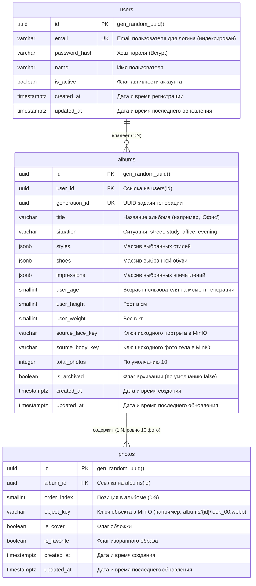

# Структура базы данных (PostgreSQL 16)

В этом документе описана основная реляционная схема базы данных для бэкенд-сервиса **AI Stylist**, включающая таблицы `users`, `albums` и `photos`.

---

## 1. ER-диаграмма (Entity-Relationship Diagram)



---

## 2. Спецификация таблиц

### 2.1. `users`
Хранит учетные записи зарегистрированных пользователей и данные аутентификации.

| Колонка | Тип | Ограничения | Описание |
|---|---|---|---|
| `id` | `UUID` | `PRIMARY KEY`, по умолчанию `gen_random_uuid()` | Уникальный идентификатор пользователя |
| `email` | `VARCHAR(255)` | `NOT NULL`, `UNIQUE`, `INDEX` | Email пользователя для входа |
| `password_hash` | `VARCHAR(255)` | `NOT NULL` | Хэш пароля (Bcrypt) |
| `name` | `VARCHAR(100)` | `NOT NULL` | Имя пользователя |
| `is_active` | `BOOLEAN` | `NOT NULL`, по умолчанию `TRUE` | Статус активности аккаунта |
| `created_at` | `TIMESTAMPTZ` | `NOT NULL`, по умолчанию `CURRENT_TIMESTAMP` | Дата и время создания аккаунта |
| `updated_at` | `TIMESTAMPTZ` | `NOT NULL`, по умолчанию `CURRENT_TIMESTAMP` | Дата и время последнего обновления |

**Индексы и ограничения:**
- `pk_users`: `PRIMARY KEY (id)`
- `uq_users_email`: `UNIQUE (email)`
- `idx_users_email`: B-tree индекс по полю `email`

---

### 2.2. `albums`
Хранит сгенерированные коллекции образов (луков) пользователя. Каждый альбом формируется после того, как AI-модуль завершает генерацию 10 образов.

| Колонка | Тип | Ограничения | Описание |
|---|---|---|---|
| `id` | `UUID` | `PRIMARY KEY`, по умолчанию `gen_random_uuid()` | Уникальный идентификатор альбома |
| `user_id` | `UUID` | `NOT NULL`, `REFERENCES users(id) ON DELETE CASCADE` | ID владельца альбома |
| `generation_id` | `UUID` | `NOT NULL`, `UNIQUE`, `INDEX` | Идентификатор связанной задачи генерации |
| `title` | `VARCHAR(100)` | `NOT NULL` | Название альбома (по умолчанию на основе ситуации, например, "Офис") |
| `situation` | `VARCHAR(50)` | `NOT NULL` | Выбранная ситуация (`street`, `study`, `office`, `evening`) |
| `styles` | `JSONB` | `NOT NULL`, по умолчанию `'[]'::jsonb` | Массив выбранных стилей (например, `["minimalism", "classic"]`) |
| `shoes` | `JSONB` | `NOT NULL`, по умолчанию `'[]'::jsonb` | Массив выбранной обуви (например, `["loafers"]`) |
| `impressions` | `JSONB` | `NOT NULL`, по умолчанию `'[]'::jsonb` | Массив выбранных впечатлений (например, `["confident", "elegant"]`) |
| `user_age` | `SMALLINT` | `NULL` | Возраст на момент генерации |
| `user_height` | `SMALLINT` | `NULL` | Рост (см) на момент генерации |
| `user_weight` | `SMALLINT` | `NULL` | Вес (кг) на момент генерации |
| `source_face_key` | `VARCHAR(512)` | `NULL` | Ключ исходного фото лица в MinIO |
| `source_body_key` | `VARCHAR(512)` | `NULL` | Ключ исходного фото тела в MinIO |
| `total_photos` | `INTEGER` | `NOT NULL`, по умолчанию `10` | Общее количество фотографий в альбоме |
| `is_archived` | `BOOLEAN` | `NOT NULL`, по умолчанию `FALSE` | Флаг нахождения в архиве |
| `created_at` | `TIMESTAMPTZ` | `NOT NULL`, по умолчанию `CURRENT_TIMESTAMP` | Дата и время завершения генерации / создания альбома |
| `updated_at` | `TIMESTAMPTZ` | `NOT NULL`, по умолчанию `CURRENT_TIMESTAMP` | Дата и время последнего обновления |

**Индексы и ограничения:**
- `pk_albums`: `PRIMARY KEY (id)`
- `fk_albums_user_id`: `FOREIGN KEY (user_id) REFERENCES users(id) ON DELETE CASCADE`
- `uq_albums_generation_id`: `UNIQUE (generation_id)`
- `idx_albums_user_id`: B-tree индекс по `user_id` (оптимизирует запрос `GET /api/v1/albums`)
- `idx_albums_user_created`: B-tree индекс по `(user_id, created_at DESC)` для быстрой сортировки
- `idx_albums_generation_id`: B-tree индекс по `generation_id`

---

### 2.3. `photos`
Хранит отдельные образы (фотографии), входящие в состав альбома.

| Колонка | Тип | Ограничения | Описание |
|---|---|---|---|
| `id` | `UUID` | `PRIMARY KEY`, по умолчанию `gen_random_uuid()` | Уникальный идентификатор фотографии |
| `album_id` | `UUID` | `NOT NULL`, `REFERENCES albums(id) ON DELETE CASCADE` | Идентификатор альбома |
| `order_index` | `SMALLINT` | `NOT NULL` | Порядковый номер отображения (от 0 до 9) |
| `object_key` | `VARCHAR(512)` | `NOT NULL` | Путь к файлу в MinIO (например, `albums/3fa85f64/look_00.webp`) |
| `is_cover` | `BOOLEAN` | `NOT NULL`, по умолчанию `FALSE` | Является ли обложкой альбома |
| `is_favorite` | `BOOLEAN` | `NOT NULL`, по умолчанию `FALSE` | Добавлено ли в избранное |
| `created_at` | `TIMESTAMPTZ` | `NOT NULL`, по умолчанию `CURRENT_TIMESTAMP` | Дата и время создания |
| `updated_at` | `TIMESTAMPTZ` | `NOT NULL`, по умолчанию `CURRENT_TIMESTAMP` | Дата и время последнего обновления |

**Индексы и ограничения:**
- `pk_photos`: `PRIMARY KEY (id)`
- `fk_photos_album_id`: `FOREIGN KEY (album_id) REFERENCES albums(id) ON DELETE CASCADE`
- `uq_photos_album_order`: `UNIQUE (album_id, order_index)` гарантирует уникальность порядкового номера в рамках альбома
- `chk_photos_order_index`: `CHECK (order_index >= 0 AND order_index < 10)` ограничение диапазона от 0 до 9
- `idx_photos_album_id`: B-tree индекс по `album_id`
- `idx_photos_album_order`: B-tree индекс по `(album_id, order_index)`

---

## 3. Стратегия хранения медиа (MinIO и Presigned URL)

1. **Ключ объекта (Object Key) вместо постоянного URL:**
   - В базе данных сохраняются **только** строковые ключи объектов (например, `albums/3fa85f64/look_00.webp`).
   - Статические URL не сохраняются в PostgreSQL, так как presigned-ссылки являются временными и защищены криптографической подписью.
2. **Динамическая генерация ссылок:**
   - При обработке запроса `GET /api/v1/albums/{album_id}` сервис перебирает фотографии альбома и вызывает метод `minio_client.presigned_get_object(...)` с заданным временем жизни (TTL, например 3600 секунд), заполняя поле `url` в ответе для фронтенда.

---

## 4. DDL-скрипт для PostgreSQL 16

```sql
-- Подключение расширения pgcrypto для генерации UUID
CREATE EXTENSION IF NOT EXISTS "pgcrypto";

-- =============================================================================
-- Таблица: users (Пользователи)
-- =============================================================================
CREATE TABLE IF NOT EXISTS users (
    id UUID PRIMARY KEY DEFAULT gen_random_uuid(),
    email VARCHAR(255) NOT NULL,
    password_hash VARCHAR(255) NOT NULL,
    name VARCHAR(100) NOT NULL,
    is_active BOOLEAN NOT NULL DEFAULT TRUE,
    created_at TIMESTAMPTZ NOT NULL DEFAULT CURRENT_TIMESTAMP,
    updated_at TIMESTAMPTZ NOT NULL DEFAULT CURRENT_TIMESTAMP,
    CONSTRAINT uq_users_email UNIQUE (email)
);

CREATE INDEX IF NOT EXISTS idx_users_email ON users(email);

-- =============================================================================
-- Таблица: albums (Альбомы генераций)
-- =============================================================================
CREATE TABLE IF NOT EXISTS albums (
    id UUID PRIMARY KEY DEFAULT gen_random_uuid(),
    user_id UUID NOT NULL,
    generation_id UUID NOT NULL,
    title VARCHAR(100) NOT NULL,
    situation VARCHAR(50) NOT NULL,
    styles JSONB NOT NULL DEFAULT '[]'::jsonb,
    shoes JSONB NOT NULL DEFAULT '[]'::jsonb,
    impressions JSONB NOT NULL DEFAULT '[]'::jsonb,
    user_age SMALLINT NULL,
    user_height SMALLINT NULL,
    user_weight SMALLINT NULL,
    source_face_key VARCHAR(512) NULL,
    source_body_key VARCHAR(512) NULL,
    total_photos INTEGER NOT NULL DEFAULT 10,
    is_archived BOOLEAN NOT NULL DEFAULT FALSE,
    created_at TIMESTAMPTZ NOT NULL DEFAULT CURRENT_TIMESTAMP,
    updated_at TIMESTAMPTZ NOT NULL DEFAULT CURRENT_TIMESTAMP,
    CONSTRAINT fk_albums_user_id FOREIGN KEY (user_id) REFERENCES users(id) ON DELETE CASCADE,
    CONSTRAINT uq_albums_generation_id UNIQUE (generation_id)
);

CREATE INDEX IF NOT EXISTS idx_albums_user_id ON albums(user_id);
CREATE INDEX IF NOT EXISTS idx_albums_user_created ON albums(user_id, created_at DESC);
CREATE INDEX IF NOT EXISTS idx_albums_generation_id ON albums(generation_id);

-- =============================================================================
-- Таблица: photos (Фотографии образов)
-- =============================================================================
CREATE TABLE IF NOT EXISTS photos (
    id UUID PRIMARY KEY DEFAULT gen_random_uuid(),
    album_id UUID NOT NULL,
    order_index SMALLINT NOT NULL,
    object_key VARCHAR(512) NOT NULL,
    is_cover BOOLEAN NOT NULL DEFAULT FALSE,
    is_favorite BOOLEAN NOT NULL DEFAULT FALSE,
    created_at TIMESTAMPTZ NOT NULL DEFAULT CURRENT_TIMESTAMP,
    updated_at TIMESTAMPTZ NOT NULL DEFAULT CURRENT_TIMESTAMP,
    CONSTRAINT fk_photos_album_id FOREIGN KEY (album_id) REFERENCES albums(id) ON DELETE CASCADE,
    CONSTRAINT uq_photos_album_order UNIQUE (album_id, order_index),
    CONSTRAINT chk_photos_order_index CHECK (order_index >= 0 AND order_index < 10)
);

CREATE INDEX IF NOT EXISTS idx_photos_album_id ON photos(album_id);
CREATE INDEX IF NOT EXISTS idx_photos_album_order ON photos(album_id, order_index);
```

---

## 5. Эталонные ORM-модели SQLAlchemy 2.0

```python
import uuid
from datetime import datetime, timezone
from typing import List, Optional

from sqlalchemy import (
    Boolean, CheckConstraint, DateTime, ForeignKey, Index, Integer,
    SmallInteger, String, UniqueConstraint, func
)
from sqlalchemy.dialects.postgresql import JSONB, UUID
from sqlalchemy.orm import DeclarativeBase, Mapped, mapped_column, relationship


class Base(DeclarativeBase):
    pass


class User(Base):
    __tablename__ = "users"

    id: Mapped[uuid.UUID] = mapped_column(
        UUID(as_uuid=True), primary_key=True, default=uuid.uuid4
    )
    email: Mapped[str] = mapped_column(String(255), unique=True, index=True, nullable=False)
    password_hash: Mapped[str] = mapped_column(String(255), nullable=False)
    name: Mapped[str] = mapped_column(String(100), nullable=False)
    is_active: Mapped[bool] = mapped_column(Boolean, default=True, nullable=False)
    created_at: Mapped[datetime] = mapped_column(
        DateTime(timezone=True),
        server_default=func.now(),
        default=lambda: datetime.now(timezone.utc),
        nullable=False,
    )
    updated_at: Mapped[datetime] = mapped_column(
        DateTime(timezone=True),
        server_default=func.now(),
        default=lambda: datetime.now(timezone.utc),
        onupdate=lambda: datetime.now(timezone.utc),
        nullable=False,
    )

    albums: Mapped[List["Album"]] = relationship(
        "Album", back_populates="user", cascade="all, delete-orphan"
    )


class Album(Base):
    __tablename__ = "albums"

    id: Mapped[uuid.UUID] = mapped_column(
        UUID(as_uuid=True), primary_key=True, default=uuid.uuid4
    )
    user_id: Mapped[uuid.UUID] = mapped_column(
        UUID(as_uuid=True), ForeignKey("users.id", ondelete="CASCADE"), nullable=False, index=True
    )
    generation_id: Mapped[uuid.UUID] = mapped_column(
        UUID(as_uuid=True), unique=True, index=True, nullable=False
    )
    title: Mapped[str] = mapped_column(String(100), nullable=False)
    situation: Mapped[str] = mapped_column(String(50), nullable=False)
    styles: Mapped[list] = mapped_column(JSONB, default=list, nullable=False)
    shoes: Mapped[list] = mapped_column(JSONB, default=list, nullable=False)
    impressions: Mapped[list] = mapped_column(JSONB, default=list, nullable=False)
    user_age: Mapped[Optional[int]] = mapped_column(SmallInteger, nullable=True)
    user_height: Mapped[Optional[int]] = mapped_column(SmallInteger, nullable=True)
    user_weight: Mapped[Optional[int]] = mapped_column(SmallInteger, nullable=True)
    source_face_key: Mapped[Optional[str]] = mapped_column(String(512), nullable=True)
    source_body_key: Mapped[Optional[str]] = mapped_column(String(512), nullable=True)
    total_photos: Mapped[int] = mapped_column(Integer, default=10, nullable=False)
    is_archived: Mapped[bool] = mapped_column(Boolean, default=False, nullable=False)
    created_at: Mapped[datetime] = mapped_column(
        DateTime(timezone=True),
        server_default=func.now(),
        default=lambda: datetime.now(timezone.utc),
        nullable=False,
    )
    updated_at: Mapped[datetime] = mapped_column(
        DateTime(timezone=True),
        server_default=func.now(),
        default=lambda: datetime.now(timezone.utc),
        onupdate=lambda: datetime.now(timezone.utc),
        nullable=False,
    )

    user: Mapped["User"] = relationship("User", back_populates="albums")
    photos: Mapped[List["Photo"]] = relationship(
        "Photo", back_populates="album", cascade="all, delete-orphan", order_by="Photo.order_index"
    )

    __table_args__ = (
        Index("idx_albums_user_created", "user_id", "created_at"),
    )


class Photo(Base):
    __tablename__ = "photos"

    id: Mapped[uuid.UUID] = mapped_column(
        UUID(as_uuid=True), primary_key=True, default=uuid.uuid4
    )
    album_id: Mapped[uuid.UUID] = mapped_column(
        UUID(as_uuid=True), ForeignKey("albums.id", ondelete="CASCADE"), nullable=False, index=True
    )
    order_index: Mapped[int] = mapped_column(SmallInteger, nullable=False)
    object_key: Mapped[str] = mapped_column(String(512), nullable=False)
    is_cover: Mapped[bool] = mapped_column(Boolean, default=False, nullable=False)
    is_favorite: Mapped[bool] = mapped_column(Boolean, default=False, nullable=False)
    created_at: Mapped[datetime] = mapped_column(
        DateTime(timezone=True),
        server_default=func.now(),
        default=lambda: datetime.now(timezone.utc),
        nullable=False,
    )
    updated_at: Mapped[datetime] = mapped_column(
        DateTime(timezone=True),
        server_default=func.now(),
        default=lambda: datetime.now(timezone.utc),
        onupdate=lambda: datetime.now(timezone.utc),
        nullable=False,
    )

    album: Mapped["Album"] = relationship("Album", back_populates="photos")

    __table_args__ = (
        UniqueConstraint("album_id", "order_index", name="uq_photos_album_order"),
        CheckConstraint("order_index >= 0 AND order_index < 10", name="chk_photos_order_index"),
    )
```
